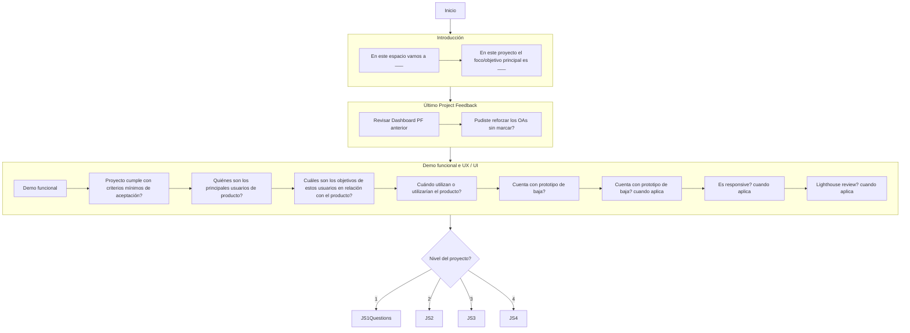

```mermaid
  flowchart TD;
      subgraph IntroQuestions [Introducción]
        direction LR
        Intro1[En este espacio vamos a ___]
        Intro1-->Intro2
        Intro2[En este proyecto el foco/objetivo principal es ___]
      end
      subgraph LastPFQuestions [Último Project Feedback]
        direction LR
        LastPF1[Revisar Dashboard PF anterior]
        LastPF1-->LastPF2
        LastPF2[Pudiste reforzar los OAs sin marcar?]
      end
      subgraph DemoQuestions [Demo funcional e UX / UI]
        direction LR        
        Demo0[Demo funcional]
        Demo0-->Demo1
        Demo1[Proyecto cumple con criterios mínimos de aceptación?]
        Demo1-->Demo2
        Demo2[Quiénes son los principales usuarios de producto?]
        Demo2-->Demo3
        Demo3[Cuáles son los objetivos de estos usuarios en relación con el producto?]
        Demo3-->Demo4
        Demo4[Cuándo utilizan o utilizarían el producto?]
        Demo4-->Demo5
        Demo5[Cuenta con prototipo de baja?]
        Demo5-->Demo6
        Demo6[Cuenta con prototipo de baja? cuando aplica]
        Demo6-->Demo7
        Demo7[Es responsive? cuando aplica]
        Demo7-->Demo8
        Demo8[Lighthouse review? cuando aplica]
      end      
    Inicio-->IntroQuestions
    IntroQuestions-->LastPFQuestions
    LastPFQuestions-->DemoQuestions
    DemoQuestions-->Level
    Level{Nivel del proyecto?}
    Level-->|1|JS1Questions
    Level-->|2|JS2
    Level-->|3|JS3
    Level-->|4|JS4
```
