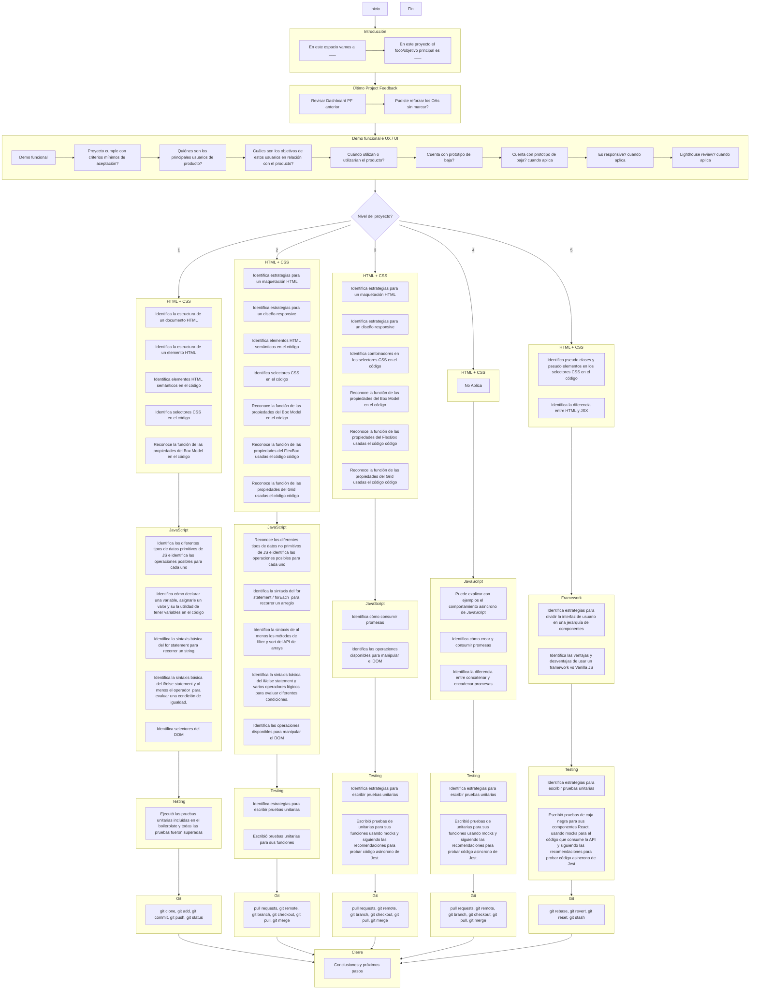

```mermaid
  flowchart TD;
    Start[Inicio]
    Start-->IntroQuestions
      subgraph IntroQuestions [Introducción]
        direction LR
        Intro1[En este espacio vamos a ___]
        Intro1-->Intro2
        Intro2[En este proyecto el foco/objetivo principal es ___]
      end
      IntroQuestions-->LastPFQuestions
      subgraph LastPFQuestions [Último Project Feedback]
        direction LR
        LastPF1[Revisar Dashboard PF anterior]
        LastPF1-->LastPF2
        LastPF2[Pudiste reforzar los OAs sin marcar?]
      end
      LastPFQuestions-->DemoQuestions
      subgraph DemoQuestions [Demo funcional e UX / UI]
        direction LR
        Demo0[Demo funcional]
        Demo0-->Demo1
        Demo1[Proyecto cumple con criterios mínimos de aceptación?]
        Demo1-->Demo2
        Demo2[Quiénes son los principales usuarios de producto?]
        Demo2-->Demo3
        Demo3[Cuáles son los objetivos de estos usuarios en relación con el producto?]
        Demo3-->Demo4
        Demo4[Cuándo utilizan o utilizarían el producto?]
        Demo4-->Demo5
        Demo5[Cuenta con prototipo de baja?]
        Demo5-->Demo6
        Demo6[Cuenta con prototipo de baja? cuando aplica]
        Demo6-->Demo7
        Demo7[Es responsive? cuando aplica]
        Demo7-->Demo8
        Demo8[Lighthouse review? cuando aplica]
      end      
    DemoQuestions-->Level
    Level{Nivel del proyecto?}
    Level-->|1|HTMLCSSQuestions1
    Level-->|2|HTMLCSSQuestions2
    Level-->|3|HTMLCSSQuestions3
    Level-->|4|HTMLCSSQuestions4
    Level-->|5|HTMLCSSQuestions5
    subgraph HTMLCSSQuestions1 [HTML + CSS]
        direction LR
        DocStructure1[Identifica la estructura de un documento HTML]
        ElemStructure1[Identifica la estructura de un elemento HTML]
        Semantic1[Identifica elementos HTML semánticos en el código]
        CSS1[Identifica selectores CSS en el código]
        Box1[Reconoce la función de las propiedades del Box Model en el código]
    end
    subgraph HTMLCSSQuestions2 [HTML + CSS]
        direction LR
        Layout2[Identifica estrategias para un maquetación HTML]
        Responsive2[Identifica estrategias para un diseño responsive]
        Semantic2[Identifica elementos HTML semánticos en el código]
        CSS2[Identifica selectores CSS en el código]
        Box2[Reconoce la función de las propiedades del Box Model en el código]
        FlexBox2[Reconoce la función de las propiedades del FlexBox usadas el código código]
        Grid2[Reconoce la función de las propiedades del Grid usadas el código código]        
    end
    subgraph HTMLCSSQuestions3 [HTML + CSS]
        direction LR
        Layout3[Identifica estrategias para un maquetación HTML]
        Responsive3[Identifica estrategias para un diseño responsive]
        CSS3[Identifica combinadores en los selectores CSS en el código]
        Box3[Reconoce la función de las propiedades del Box Model en el código]
        FlexBox3[Reconoce la función de las propiedades del FlexBox usadas el código código]
        Grid3[Reconoce la función de las propiedades del Grid usadas el código código]        
    end
    subgraph HTMLCSSQuestions4 [HTML + CSS]
        NA[No Aplica]
    end
    subgraph HTMLCSSQuestions5 [HTML + CSS]
        direction LR
        CSS5[Identifica pseudo clases y pseudo elementos en los selectores CSS en el código]
        JSX1[Identifica la diferencia entre HTML y JSX]        
    end
    HTMLCSSQuestions1-->JSQuestions1
    HTMLCSSQuestions2-->JSQuestions2
    HTMLCSSQuestions3-->JSQuestions3
    HTMLCSSQuestions4-->JSQuestions4
    HTMLCSSQuestions5-->JSQuestions5
    subgraph JSQuestions1 [JavaScript]
        direction LR
        DataTypes1[Identifica los diferentes tipos de datos primitivos de JS e identifica las operaciones posibles para cada uno]
        Variables1[Identifica cómo declarar una variable, asignarle un valor y su la utilidad de tener variables en el código]
        Loops1[Identifica la sintaxis básica del for statement para recorrer un string]
        Conditionals1[Identifica la sintaxis básica del if/else statement y al menos el operador  para evaluar una condición de igualdad.]
        DOM1[Identifica selectores del DOM]
    end
    subgraph JSQuestions2 [JavaScript]
        direction LR
        DataTypes2[Reconoce los diferentes tipos de datos no primitivos de JS e identifica las operaciones posibles para cada uno]
        Loops2[Identifica la sintaxis del for statement / forEach  para recorrer un arreglo]
        Arrays2[Identifica la sintaxis de al menos los métodos de filter y sort del API de arrays]
        Conditionals2[Identifica la sintaxis básica del if/else statement y varios operadores lógicos para evaluar diferentes condiciones.]
        DOM2[Identifica las operaciones disponibles para manipular el DOM]
    end
    subgraph JSQuestions3 [JavaScript]
        direction LR
        Promises3[Identifica cómo consumir promesas]
        DOM3[Identifica las operaciones disponibles para manipular el DOM]
    end
    subgraph JSQuestions4 [JavaScript]
        direction LR
        Async4[Puede explicar con ejemplos el comportamiento asincrono de JavaScript]
        CreatePromises4[Identifica cómo crear y consumir promesas]
        Promises4[Identifica la diferencia entre concatenar y encadenar promesas]
    end
    subgraph JSQuestions5 [Framework]
        direction LR        
        Composition5[Identifica estrategias para dividir la interfaz de usuario en una jerarquía de componentes]
        Framework5[Identifica las ventajas y desventajas de usar un framework vs Vanilla JS]
    end
    JSQuestions1-->TestingQuestions1
    JSQuestions2-->TestingQuestions2
    JSQuestions3-->TestingQuestions3
    JSQuestions4-->TestingQuestions4
    JSQuestions5-->TestingQuestions5
    subgraph TestingQuestions1 [Testing]
        direction LR
        Testin1g[Ejecutó las pruebas unitarias incluidas en el boilerplate y todas las pruebas fueron superadas]
    end
    subgraph TestingQuestions2 [Testing]
        direction LR
        Strategy2[Identifica estrategias para escribir pruebas unitarias]
        Testing2[Escribió pruebas unitarias para sus funciones]
    end
    subgraph TestingQuestions3 [Testing]
        direction LR
        Strategy3[Identifica estrategias para escribir pruebas unitarias]
        Testing3[Escribió pruebas de unitarias para sus funciones usando mocks y siguiendo las recomendaciones para probar código asincrono de Jest.]
    end
    subgraph TestingQuestions4 [Testing]
        direction LR
        Strategy4[Identifica estrategias para escribir pruebas unitarias]
        Testing4[Escribió pruebas de unitarias para sus funciones usando mocks y siguiendo las recomendaciones para probar código asincrono de Jest.]
    end
    subgraph TestingQuestions5 [Testing]
        direction LR
        Strategy5[Identifica estrategias para escribir pruebas unitarias]
        Testing5[Escribió pruebas de caja negra para sus componentes React, usando mocks para el código que consume la API y siguiendo las recomendaciones para probar código asincrono de Jest]
    end
    TestingQuestions1-->GitQuestions1
    TestingQuestions2-->GitQuestions2
    TestingQuestions3-->GitQuestions3
    TestingQuestions4-->GitQuestions4
    TestingQuestions5-->GitQuestions5
    subgraph GitQuestions1 [Git]
        direction LR
        Git1[git clone, git add, git commit, git push, git status]
    end
    subgraph GitQuestions2 [Git]
        direction LR
        Git2[pull requests, git remote, git branch, git checkout, git pull, git merge]
    end
    subgraph GitQuestions3 [Git]
        direction LR
        Git3[pull requests, git remote, git branch, git checkout, git pull, git merge]
    end
    subgraph GitQuestions4 [Git]
        direction LR
        Git4[pull requests, git remote, git branch, git checkout, git pull, git merge]
    end
    subgraph GitQuestions5 [Git]
        direction LR
        Git5[git rebase, git revert, git reset, git stash]
    end
    GitQuestions1-->Close
    GitQuestions2-->Close
    GitQuestions3-->Close
    GitQuestions4-->Close
    GitQuestions5-->Close
    subgraph Close [Cierre]
        direction LR
        NextSteps[Conclusiones y próximos pasos]
    end
    Finish[Fin]
```
